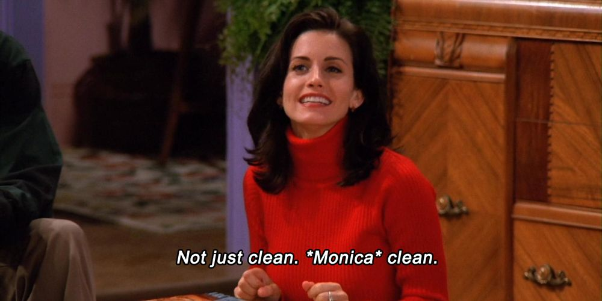

# My First Project

## About Me
I am a former elementary school special education teacher turned instructional designer. I completed my undergrad (Special Education) and grad school (Early Childhood Education) at UF. I am a part time makeup artist. 
## Past Coding Experience
I have no coding experience. 
## Career Goals 
1. Lead learning experience design department
2. Make passive income from makeup videos  
    1. The freedom to work for myself 

